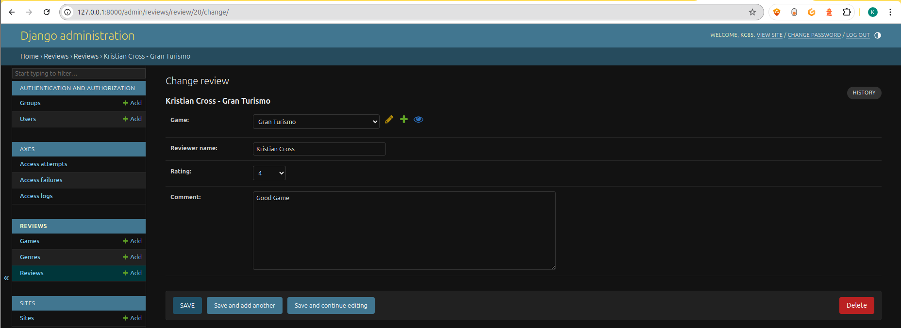

# Testing

> [!NOTE]
> Return back to the [README.md](README.md) file.

## Code Validation

### HTML

🛑 IMPORTANT 🛑

RE: Python/Jinja syntax in HTML

Python projects that use Jinja syntax, such as ``, ``, and `{{ variable|filter }}` will not validate properly if you're copying/pasting into the HTML validator.

In order to properly validate these types of files, it's recommended to [validate by uri](https://validator.w3.org/#validate_by_uri) from the deployed Heroku pages.

Unfortunately, pages that require a user to be "logged-in" and authenticated (CRUD functionality) will not work using this method, due to the fact that the HTML Validator (W3C) doesn't have access to login to an account on your project. In order to properly validate HTML pages with Jinja syntax for authenticated pages, follow these steps:

- Navigate to the deployed pages which require authentication.
- Right-click anywhere on the page, and select **View Page Source** (usually `CTRL+U` or `⌘+U` on Mac).
- This will display the entire "compiled" code, without any Jinja syntax.
- Copy everything, and use the [validate by input](https://validator.w3.org/#validate_by_input) method.
- Repeat this process for every page that requires a user to be logged-in/authenticated (e.g.: CRUD functionality).

🛑 ---- END --- 🛑

I have used the recommended [HTML W3C Validator](https://validator.w3.org) to validate all of my HTML files.

| Directory | File | URL | Screenshot | Notes |
| --- | --- | --- | --- | --- |
| reviews | [all_reviews.html](https://github.com/KC-85/Joystick_Journalist/blob/main/reviews/templates/reviews/all_reviews.html) | Link (if applicable) |  | Note: Delete review shows in the compiled HTML. |
| reviews | [form_page.html](https://github.com/KC-85/Joystick_Journalist/blob/main/reviews/templates/reviews/form_page.html) | Link (if applicable) |  | Note: This template is for adding games. |
| reviews | [hero.html](https://github.com/KC-85/Joystick_Journalist/blob/main/reviews/templates/reviews/hero.html) | Link (if applicable) |  | Notes (if applicable) |
| reviews | [landing_page.html](https://github.com/KC-85/Joystick_Journalist/blob/main/reviews/templates/reviews/landing_page.html) | Link (if applicable) |  | Note: Add review shows in the compiled HTML. |
| reviews | [login.html](https://github.com/KC-85/Joystick_Journalist/blob/main/reviews/templates/reviews/login.html) | Link (if applicable) |  | Notes (if applicable) |
| reviews | [register.html](https://github.com/KC-85/Joystick_Journalist/blob/main/reviews/templates/reviews/register.html) | Link (if applicable) |  | Notes (if applicable) |
| reviews | [lockout.html](https://github.com/KC-85/Joystick_Journalist/blob/main/reviews/templates/reviews/lockout.html) | Link (if applicable) |  | Notes (if applicable) |


### CSS

I have used the recommended [CSS Jigsaw Validator](https://jigsaw.w3.org/css-validator) to validate all of my CSS files.

| Directory | File | URL | Screenshot | Notes |
| --- | --- | --- | --- | --- |
| reviews | [style.css](https://github.com/KC-85/Joystick_Journalist/blob/main/reviews/static/css/style.css) | Link (if applicable) |  | Notes (if applicable) |


### JavaScript

I have used the recommended [JShint Validator](https://jshint.com) to validate all of my JS files.

| Directory | File | URL | Screenshot | Notes |
| --- | --- | --- | --- | --- |
| reviews | [main.js](https://github.com/KC-85/Joystick_Journalist/blob/main/reviews/static/js/main.js) | N/A |  | Notes (if applicable) |


### Python

🛑 IMPORTANT 🛑

**IMPORTANT**: Django settings

The Django `settings.py` file comes with 4 lines that are quite long, and will throw the `E501 line too long` error. This is default behavior, but can be fixed by adding the "`  # noqa`" comment at the end of those lines.

```python
AUTH_PASSWORD_VALIDATORS = [
    {
        "NAME": "django.contrib.auth.password_validation.UserAttributeSimilarityValidator",  # noqa
    },
    {
        "NAME": "django.contrib.auth.password_validation.MinimumLengthValidator",  # noqa
    },
    {
        "NAME": "django.contrib.auth.password_validation.CommonPasswordValidator",  # noqa
    },
    {
        "NAME": "django.contrib.auth.password_validation.NumericPasswordValidator",  # noqa
    },
]
```

**IMPORTANT**: *migration* and *pycache* files

You do not have to validate files from the `migrations/` or `pycache/` folders! Ignore these `.py` files, and validate just the files that you've created or modified.

🛑 --- END --- 🛑

I have used the recommended [PEP8 CI Python Linter](https://pep8ci.herokuapp.com) to validate all of my Python files.

| Directory | File | URL | Screenshot | Notes |
| --- | --- | --- | --- | --- |
| core | [settings.py](https://github.com/KC-85/Joystick_Journalist/blob/main/core/settings.py) | [PEP8 CI Link](https://pep8ci.herokuapp.com/https://raw.githubusercontent.com/KC-85/Joystick_Journalist/main/core/settings.py) |  | Where it shows validation errors for *Password Validation* in settings.py, these cannot be fixed by just separating the line with brackets/parentheses, as this would cause the validated code to not function properly, hence **#noqa** |
| core | [urls.py](https://github.com/KC-85/Joystick_Journalist/blob/main/core/urls.py) | [PEP8 CI Link](https://pep8ci.herokuapp.com/https://raw.githubusercontent.com/KC-85/Joystick_Journalist/main/core/urls.py) |  | Notes (if applicable) |
| root directory | [manage.py](https://github.com/KC-85/Joystick_Journalist/blob/main/manage.py) | [PEP8 CI Link](https://pep8ci.herokuapp.com/https://raw.githubusercontent.com/KC-85/Joystick_Journalist/main/manage.py) |  | Notes (if applicable) |
| reviews | [admin.py](https://github.com/KC-85/Joystick_Journalist/blob/main/reviews/admin.py) | [PEP8 CI Link](https://pep8ci.herokuapp.com/https://raw.githubusercontent.com/KC-85/Joystick_Journalist/main/reviews/admin.py) |  | Notes (if applicable) |
| reviews | [forms.py](https://github.com/KC-85/Joystick_Journalist/blob/main/reviews/forms.py) | [PEP8 CI Link](https://pep8ci.herokuapp.com/https://raw.githubusercontent.com/KC-85/Joystick_Journalist/main/reviews/forms.py) |  | Notes (if applicable) |
| reviews | [login_middleware.py](https://github.com/KC-85/Joystick_Journalist/blob/main/reviews/login_middleware.py) | [PEP8 CI Link](https://pep8ci.herokuapp.com/https://raw.githubusercontent.com/KC-85/Joystick_Journalist/main/reviews/login_middleware.py) |  | Notes (if applicable) |
| reviews | [models.py](https://github.com/KC-85/Joystick_Journalist/blob/main/reviews/models.py) | [PEP8 CI Link](https://pep8ci.herokuapp.com/https://raw.githubusercontent.com/KC-85/Joystick_Journalist/main/reviews/models.py) |  | Notes (if applicable) |
| reviews | [urls.py](https://github.com/KC-85/Joystick_Journalist/blob/main/reviews/urls.py) | [PEP8 CI Link](https://pep8ci.herokuapp.com/https://raw.githubusercontent.com/KC-85/Joystick_Journalist/main/reviews/urls.py) |  | Notes (if applicable) |
| reviews | [views.py](https://github.com/KC-85/Joystick_Journalist/blob/main/reviews/views.py) | [PEP8 CI Link](https://pep8ci.herokuapp.com/https://raw.githubusercontent.com/KC-85/Joystick_Journalist/main/reviews/views.py) |  | Notes (if applicable) |


## Responsiveness


I've tested my deployed project to check for responsiveness issues.

| Page | Mobile | Tablet | Desktop | Notes |
| --- | --- | --- | --- | --- |
| Register |  |  |  | Works as expected |
| Login |  |  |  | Works as expected |
| Landing Page |  |  |  | Works as expected |
| Add Game |  |  |  | Works as expected |
| Add Review |  |  |  | Works as expected |
| Edit Review |  |  |  | Works as expected |
| All Reviews |  |  |  | Works as expected |
| 404 |  |  |  | Works as expected |

## Browser Compatibility

I've tested my deployed project on multiple browsers to check for compatibility issues.

| Page | Chrome | Firefox | Brave | Notes |
| --- | --- | --- | --- | --- |
| Hero Page |  |  |  | Works as expected |
| Register |  |  |  | Works as expected |
| Login |  |  |  | Works as expected |
| Landing Page |  |  |  | Works as expected |
| Add Game |  |  |  | Works as expected |
| Add Review |  |  |  | Works as expected |
| Edit Review |  |  |  | Works as expected |
| 404 |  |  |  | Works as expected |

## Lighthouse Audit

I've tested my deployed project using the Lighthouse Audit tool to check for any major issues. Some warnings are outside of my control, and mobile results tend to be lower than desktop.

| Page | Mobile | Desktop |
| --- | --- | --- |
| Hero |  |  |
| Login |  |  |
| Register |  |  |
| Landing Page (Game List) |  |  |
| Add Game |  |  |
| Add Review |  |  |
| Edit Review |  |  |
| All Reviews |  |  |
| 404 |  |  |

- **Note:** Delete Review shows up a pop up message instead of a seperate page, and therefore I am unable to test it's lighthouse score.

## Defensive Programming


Defensive programming was manually tested with the below user acceptance testing:

| Page | Expectation | Test | Result | Screenshot |
| --- | --- | --- | --- | --- |
| Registration | Users cannot submit an empty registration form | Attempted to submit empty registration form | Blocked with validation messages |  |
| Login | Users cannot login with invalid credentials | Attempted login with incorrect password | Login denied with error |  |
| Axes Lockout | Lock user after 3 failed login attempts | Entered wrong password 3 times | Lockout page displayed |  |
| Add Review | Guest users cannot create reviews | Tried to access add review URL as guest | Redirected to login |  |
| Edit Review | Users cannot edit another user’s review | Logged in as User-B and attempted to edit User-A review | Review button does not come up on another users review |  |
| Delete Review | Users cannot delete another user’s review | Logged in as User-B and attempted delete User-A review | Delete button does not come up on another users review |  |
| Add Game | Only superusers can add new games | Logged in as standard user and attempted access | Hidden UI |  |
| Admin Area | Standard users cannot access Django admin | Attempted to access `/admin` as standard user | Access denied / redirected |  |
| 404 Error Page | Invalid URLs show custom 404 page | Navigated to invalid URL | Custom 404 displayed |  |


## User Story Testing

| Target | Expectation | Outcome | Screenshot |
| --- | --- | --- | --- |
| As a site visitor/guest | I would like to see an introduction to the site (Hero Section) | Pass |  |
| As a site visitor/guest | I would like to be able to register for a user account | Pass |  |
| As a registered user | I would like to login to the site | Pass |  |
| As a registered user | I would like to add a game | Pass |  |
| As a registered user | I would like to see details for each game, such as genre and release year | Pass |  |
| As a registered user | I would like to add a game review | Pass |  |
| As a registered user | I would like to update a game review i made | Pass |  |
| As a registered user  | I would like to delete a game review that i made | Pass |  |
| As a registered user | I would like to delete a game that i added | Pass |  |
| As a site owner | I would like to edit or delete a user review | Pass |  |
| As a registered user | I would like my comment to show my name | Pass |  |
| As a registered user | I would like to edit or delete my own reviews | Pass |  |
| As a registered user | I would like to see a 404 error page if I get lost | Pass |  |
| As a site owner | I would like to see a login error page | Pass |  |


## Automated Testing

I have conducted a series of automated tests on my application.

> [!NOTE]
> I fully acknowledge and understand that, in a real-world scenario, an extensive set of additional tests would be more comprehensive.

### Python (Unit Testing)

I have used Django's built-in unit testing framework to test the application functionality. In order to run the tests, I ran the following command in the terminal each time:

- `python3 manage.py test name-of-app`

To create the coverage report, I would then run the following commands:

- `pip3 install coverage`
- `pip3 freeze --local > requirements.txt`
- `pip freeze > requirements.txt`
- `coverage run manage.py test`
- `coverage report`

To see the HTML version of the reports, and find out whether some pieces of code were missing, I ran the following commands:

- `coverage html`
- `coverage run --source+'.' manage.py test`
- `coverage report -m`

Below are the results from the full coverage report on my application that I've tested:


#### Unit Test Issues

- No issues with unit testing.

## Bugs

- Please see **[Issues](https://www.github.com/KC-85/Joystick_Journalist/issues)** for bugs.

### Fixed Bugs

[](https://www.github.com/KC-85/Joystick_Journalist/issues?q=is%3Aissue+is%3Aclosed+label%3Abug)

I've used [GitHub Issues](https://www.github.com/KC-85/Joystick_Journalist/issues) to track and manage bugs and issues during the development stages of my project.

All previously closed/fixed bugs can be tracked [here](https://www.github.com/KC-85/Joystick_Journalist/issues?q=is%3Aissue+is%3Aclosed+label%3Abug).


### Unfixed Bugs

- All known bugs are fixed.

[](https://www.github.com/KC-85/Joystick_Journalist/issues)

Any remaining open issues can be tracked [here](https://www.github.com/KC-85/Joystick_Journalist/issues).


### Known Issues

- There are no known issues.

> [!IMPORTANT]
> There are no remaining bugs that I am aware of, though, even after thorough testing, I cannot rule out the possibility.

